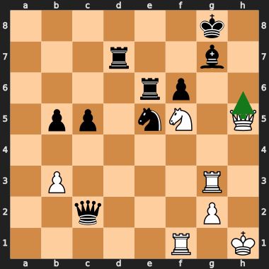
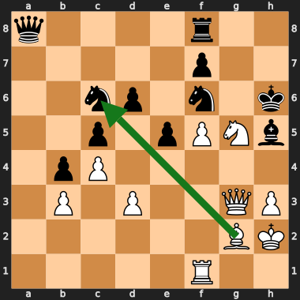
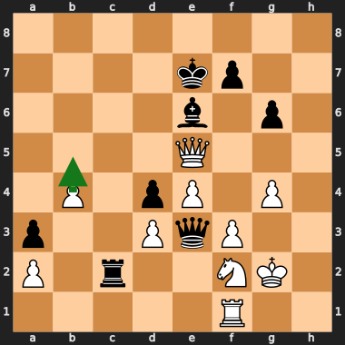
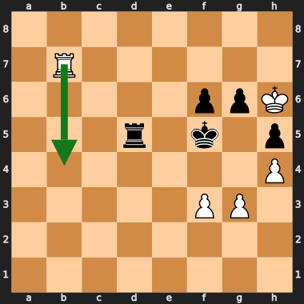
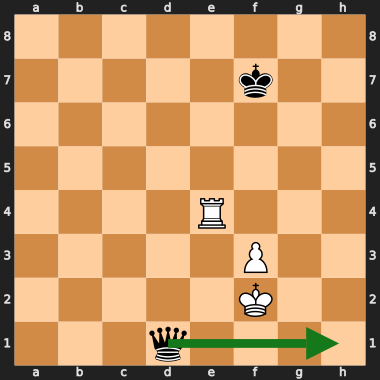
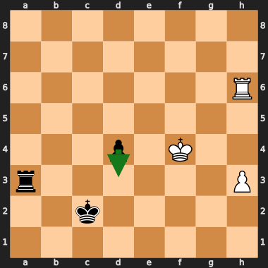
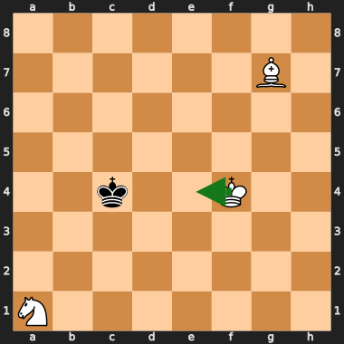

# Eval Overrate & Blind-spot Findings (living document)

**Purpose.** A shared, growing log of positions where Coda's evaluation is
*wrong* — almost always **overrating** its own position — discovered by mining
real gauntlet games against the top-20 engines and cross-checking with
Stockfish (SF) as a trusted third party. This doc is for both humans (Adam) and
other Claude instances. The wandering-bishop work showed that a doc with
**concrete positions + diagrams + a named theme** is what makes a blind-spot
class fixable (there, mixing a few % of self-play-vs-SF into the training set —
unfiltered — measurably cut the overscoring of that class).

**Status:** started 2026-06-28. Pipeline is `scripts/game_analysis.py`
(taxonomy / mine / oracle / features). Tooling notes at the bottom.

> **One-line takeaway so far:** the overrate is *not* a single bug. It splits
> into three themes — (1) **illusory attacks** the threat features over-value,
> (2) **drawn-endgame blindness**, (3) **search-leaf inflation** over an honest
> static eval. The static NNUE is the dominant culprit only for theme (1).

---

## How the data is produced (methodology)

1. **Gauntlet.** Coda (12+0.12) vs 19 top-20 engines (10+0.1), ~950 games,
   eval-per-move recorded for both sides (STM-POV in PGN comments). Also run at
   1.2× and 2× Coda time to measure *time-elasticity* (see below).
2. **Mine** (`game_analysis.py mine`). Convert both evals to **Coda-POV**.
   `overrate = coda_self − opp_of_coda`. Keep only **draws/losses** with a
   **sustained** overrate (≥150cp over ≥6 plies) — a big eval that *won* is
   correct, not an overrate. This is the load-bearing filter: result + opponent
   disagreement together.
3. **Oracle** (`game_analysis.py oracle`). Re-score each candidate with SF
   (depth 24) as ground truth. `true_overrate = coda_self − sf_coda_pov`.
   - **Bucket B** (`true_overrate ≥ 150 & sf ≤ 250`): SF confirms Coda is
     genuinely overrating. **35 of 43 candidates (81%)** landed here — SF sides
     with the *opponent*, even weak ones (Quanticade, Starzix). Result split:
     **2 losses, 33 draws, 0 wins.**
   - **Bucket A** (the other 8): Coda was right and the *opponent* mis-evaluated,
     or it's a conversion/technique failure (see the KBN game below).
4. **Static-vs-search decomposition** (the key diagnostic). For each bucket-B
   FEN compare three numbers in Coda-POV:
   - **STATIC** = Coda's NNUE eval with **no search** (UCI `eval`).
   - **SEARCH** = Coda's in-game eval (`coda_self`, search at game TC).
   - **SF** = ground truth (depth 24+).
   On the **27 quiet** positions (where static eval is trustworthy):
   - mean **static − SF = −0.61** · mean **search − SF = +2.87**
   - **11 EVAL-blind** (static itself ≥1.5 over SF) · **16 SEARCH-inflate**
     (static ≈/below SF, search runs high).
   (8 more positions are tactical/in-check, where static eval is meaningless and
   excluded.)

**Reading that result.** Across the *same* mined positions the **static net is,
on average, slightly *below* SF** — so "threats make the static eval too high"
is **not** the systematic cause. It is real for a specific cluster (theme 1),
but the larger numeric gap is the **search** returning ~+2.9 over truth from
positions the root static rates honestly. That points at the search reaching
**leaves the NNUE overrates a few plies forward**, not a root-eval bug. (Next
experiment: walk Coda's PV to the leaf and static-eval it — see Open Questions.)

---

## Time-elasticity: which deficits are tactical vs strategic

From the 1× / 1.2× / 2× gauntlets (Coda_score = 100 − opp_score%, since each
opponent plays only Coda). How much does *more time* close the gap?

- **Tactical / depth-bound (time helps a lot — closeable by NPS, pruning,
  ordering):** Viridithas (52→72, +20), Reckless (31→50, +19), PlentyChess
  (44→62, +18), Clover (+16), Obsidian / Cinder (+14).
- **Strategic / eval-bound (time barely helps — this is where eval quality is
  the wall):** Alexandria (50→54, +4), Integral (53→58, +5), Stockfish (34→43,
  +9, partly ceiling).

**Convergent signal:** Integral shows up as *both* a top overrate-draw source
**and** low time-elasticity → it is the cleanest strategic-eval target. Most of
Coda's deficit-to-field, though, is tactical/depth (search-efficiency leverage),
not eval.

---

## The themes (with positions)

Three recurring classes. Diagrams are White-at-bottom; the score line is
Coda-POV (so "+" = Coda thinks it is better).

### Theme 1 — Illusory attacks (threat features over-value an attack that is only a draw)

The net's heavy threat features light up on a queen+piece battery near the enemy
king and read it as winning, when the attack is in fact a perpetual or fully
defensible — frequently while Coda is materially **equal or down**. This is the
cluster where the **static eval itself** is wrong, so it is the prime
**training-correction** target and the strongest support for Adam's
threat-feature hypothesis.

#### Stormphrax (move 40) — only a perpetual

`6k1/3r2b1/4rp2/1pp1nN1Q/8/1P4R1/2q3P1/5R1K w - - 4 40`

> Coda search **+7.06** · static **+2.86**, SF **+0.00**

SF PV: Qh6 Ree7 Qh5 Re6 (repetition). Coda is White and **a clean minor piece down** (Black has N+B for nothing). The threat features value the Qh5/Nf5 battery at +7; there is no breakthrough — it is a draw by perpetual.

#### Quanticade (move 27) — EVAL-blind: the *static* net says +5.46

`q4r2/5p2/2np1n1k/2p1pPNb/1pP5/1P1P2QP/6BK/5R2 w - - 1 27`

> Coda search **+5.58** · static **+5.46**, SF **+0.38**

SF PV: Bxc6 Qxc6 Qe3 … ≈equal. The static net (no search) already returns +5.46 on a position SF calls +0.46. The Ng5 + Qg3 attacking shape reads as winning; Black is fine once the c6 knight is traded. This is the purest threat-overrate in the set.

### Theme 2 — Drawn-endgame blindness

Balanced rook endings, queen endings, and Q-vs-R / minor-piece technique. The
net overrates "I have an active piece / extra-looking structure" in positions
that are fundamentally drawn or very hard to convert. Mix of EVAL-blind
(PlentyChess static +4.02) and search-inflated. This is the same family as the
**KBN-vs-K** game below: the eval can even be *correct* while the failure is
*conversion*, or the eval overrates an objectively drawn ending.

#### PlentyChess (move 34) — EVAL-blind queen ending (static +4.02)

`8/4kp2/4b1p1/4Q3/1P1pP1P1/p2PqP2/P1r2NK1/5R2 w - - 3 34`

> Coda search **+3.15** · static **+4.02**, SF **+0.07**

SF PV: b5 g5 Qb8 … 0.00. Static +4.02 vs SF +0.07. Net overrates the centralised Qe5 + pawn mass and misses Black's a3 passer + active Qe3/Rc2 counterplay.

#### Viridithas (move 72) — balanced rook ending read as +3.9

`8/1R6/5ppK/3r1k1p/7P/5PP1/8/8 w - - 0 72`

> Coda search **+3.90** · static **+3.30**, SF **+0.18**

SF PV: Rb4 g5 … +0.18. Material dead equal (R+3P each). Textbook drawn rook ending; the net scores activity as +3.9 and does not grasp the drawing tendency of balanced rook endgames.

#### Clover (move 81) — Q-vs-R, right sign, magnitude overrate

`8/5k2/8/8/4R3/5P2/5K2/3q4 b - - 1 81`

> Coda search **+5.49** · SF **+1.82**

SF PV: Qh1 Re2 … +1.82 (slow technical Q-vs-R win). Coda (Black) correctly sees it is winning, but +5.49 vs +1.82 overstates how easy the conversion is — and it was not converted (drawn).

### Theme 3 — Search-leaf inflation (honest static, optimistic search)

16 of 27 quiet bucket-B positions: the root **static eval is fine (≈ or below
SF)** but the **search returns +2 to +5**. The search is reaching leaves the
NNUE overrates a few plies forward and propagating that back. Still ultimately
an eval problem — but at the *leaf*, not the root — so the same training
correction should help; if it doesn't, it's a genuine search-optimism bug.

#### Integral (move 57) — drawn R+P ending, search inflates to +2.87

`8/8/7R/8/3p1K2/r6P/2k5/8 b - - 2 57`

> Coda search **+2.87** · static **-1.55**, SF **+0.00**

SF PV: d3 Rc6+ … 0.00. R+P vs R+P, dead drawn. STATIC is honest (−1.55); the SEARCH returns +2.87. The overrate is produced by the search, not the root eval — the leaf-inflation class.

---

## Egregious example — the +8 Integral draw (KBN-vs-K: eval was RIGHT)

*KBN-v-K (Hobbes m74, `8/6B1/8/8/2k2K2/8/8/N7 w`). Objectively won (SF: deep
mate); Coda reads a flat ~+6 (B+N material) and shuffles. Green arrow = SF's
move. Full investigation: §"Is the 'unable to convert' a bad pruning bug?".*

The headline game that kicked this off (Coda scoring ~+8 vs Integral ~0, drawn)
turned out **not** to be an eval blind-spot. It reduced to **KBN-vs-K**, a
forced win. Coda's eval was *correct* (static **+10.83**, SF mate). The failure
was **conversion/technique**: Coda burned the 50-move count shuffling, then
played **Bd5?? Kxd5** hanging the bishop into KN-vs-K — a dead draw. Training
data will **not** fix this class; it is endgame technique (mate-distance /
tablebase-style knowledge / 50-move awareness in search). Logged here because it
is the canonical "big eval that drew" and shows why the **result + SF** filter
matters: without SF this looks like a −8 eval bug; with SF it is a conversion
bug. Keep these two classes separate.

---

## Is the "unable to convert" a *bad pruning* bug? (investigation, 2026-06-28)

**Hypothesis (Adam):** "We should be able to find most of these mates given our
search depth — the unable-to-convert might be a 'bad pruning' bug." Tested on the
7 conversion-failure positions, **fixed time** (never fixed depth — it explodes
in complex positions), no assumption the mate is out of horizon (codabot
regularly hits 40-ply / seldepth 50+).

### Step 1 — disable ALL forward pruning at once (flawed, but the first cut)

`go movetime 15000`, baseline vs `NO_LMR+NMP+RFP+FUTILITY+LMP+SEE+BAD_NOISY+PROBCUT+RAZOR`:

| position | SF | Coda normal 15s | Coda ALL-prune-off 15s |
|---|---|---|---|
| Hobbes m74 KBN-v-K | mate33 | d28 sd37 cp626 f4e4 | d12 sd45 cp668 f4e4 |
| Integral m101 KBN-v-K | cp8115 | d30 cp688 c6c5 | d16 cp640 c6c5 |
| Integral m80 KBN-v-K+P | mate15 | d21 cp814 b7f3 | d10 cp834 b7f3 |
| Caissa m72 Q-v-R | cp278 | d21 cp545 | d20 cp573 |
| Clover m81 Q-v-R+P | cp216 | d29 cp557 | d23 cp568 |
| Stormphrax m65 Q+P-v-Q | cp132 | d26 cp475 | d17 cp506 |
| Astra m38 R+B-v-R | cp337 | d30 cp458 | d12 cp477 |

Same move, scores within ~30cp, **no hidden mate** — but this test is
**confounded**: turning everything off collapses depth (d28→d12), so "no mate
appeared" can't distinguish *pruning hid it* from *we lost the depth*. (Adam
caught this.) It also splits the 7 positions: the **KBN** trio is objectively
won (SF mate/huge); the other four are **not conversion failures at all** — SF
rates them only +1.3 to +3.4 (drawish/fortress Q-v-R, R+B-v-R, Q+P-v-Q) and Coda
**overrates by ~250–350cp** → that's **Theme 2**, not a missed win.

### Step 2 — Coda's KBN mate horizon (why it shuffles)

Walking SF's mating line from the Hobbes position and probing Coda (5s) at
decreasing true mate-distance:

| true dist | SF | Coda 5s |
|---|---|---|
| mate20 | mate20 | cp471 |
| mate17 | mate17 | cp445 |
| mate12 | mate12 | cp422 |
| mate11 | mate11 | cp351 |
| **mate9** | mate9 | **mate11** ← locks on |
| mate10 | mate10 | mate11 |
| mate8 | mate8 | mate9 |

**Coda's KBN mate horizon is ~mate-9/10.** Within it, Coda *does* find the mate
(so there is **no structural blindness** / no missing mate logic). The game
position is **mate-33** — over 3× the horizon. Worse, **the cp eval has no useful
gradient — it falls as the mate nears** (cp471@mate20 → cp351@mate11). The NNUE
reads a flat ~+6 (B+N material) regardless of where the kings are, so the search
has *nothing to climb* to navigate the ~60-ply king-driving maneuver into its own
horizon. Even Stockfish needs 25s + SMP and still reports `cp 8115`, not a mate —
this KBN is genuinely deep, not a Coda quirk.

### Step 3 — per-feature ablation (the *correct* test of the hypothesis)

Disable features **one at a time** at fixed 8s (preserves general depth), on the
boundary positions where baseline is *just* failing:

| position | baseline | NO_LMR | NO_RFP | NO_FUT | NO_RFP+FUT |
|---|---|---|---|---|---|
| GAME mate33 | d26/cp626 | d26/cp626 | d20/cp631 | d22/cp639 | d17/cp654 |
| ply24 mate12 | d18/cp422 | d18/cp422 | d17/cp402 | d21/cp438 | d17/cp410 |
| ply26 mate11 | d19/cp351 | **d19/cp351** | **d19/mate12** | **d21/cp20473** | d19/cp346 |
| ply30 mate11 | d19/cp354 | d19/cp354 | **d19/cp17432** | d21/cp9217 | d17/cp358 |

**Verdict — Adam's hypothesis is confirmed for RFP and futility, not LMR:**
- **RFP-off and FUT-off alone flip cp→mate at the boundary, at the *same depth*** (ply26: baseline `d19/cp351` → NO_RFP `d19/mate12`; ply30 `cp354`→`cp17432`). Same d19 ⇒ pruning hid the line, *not* lost depth. Reproducible across two runs.
- **NO_LMR is byte-identical to baseline.** Not a wiring bug (`FEAT_LMR` is read at search.rs:4310/4434) — LMR only *reduces then re-searches*, so the mating line still surfaces; it isn't the binding prune in flat-eval endgames. RFP/futility are **hard** static-margin prunes (early cutoff / skip, no re-search), so they're what chops the progress move.
- **But it is immaterial to the actual game:** with RFP+FUT both off, the mate-33 game position stays flat at **cp654 — still no mate** (and only d17, because removing both prunes *costs* depth). The pruning misfire is worth ~**1 ply of mate-horizon** (flips mate-11, not mate-12). `NO_RFP+FUT` is *worse* than either alone at ply26 (mate lost) — the depth/pruning trade-off Adam predicted.

### Conclusion

The KBN draw is **not** caused by bad pruning. Root cause = **flat (even
inverted) NNUE eval gradient** + mate-distance ~3× the search horizon; in
deployment it is fully covered by **Syzygy TB** (KBN-v-K = 4 men; this gauntlet
ran TB-less, which is why it surfaced). Training will not fix it (endgame
technique / TB knowledge), consistent with the egregious-example classification
above.

**However, the experiment independently re-confirms a real, separate finding:**
RFP (and to a lesser extent futility) **does prune good lines** when the static
eval is a flat plateau above beta. This is the same failure quantified in
`docs/rfp_futility_audit_2026-06-24.md`: RFP is the dominant pruner (**301/Kn**),
and the `RFP_AUDIT` null-verification shows a **42–45% false-positive rate at
d=1–3 (98% of RFP volume)** — i.e. ~2 in 5 shallow RFP cuts disagree with an
NMP-style verification. The structural cause (RFP-1) is that Coda's shallow base
margin multiplier (~34) is **half the peer consensus (~70–87)**; Coda cuts at
beta+222 @ d6 where peers require beta+420–522. **The mate/TB guard exists on
the eval side now** (`static_eval.abs() < MATE_SCORE-200`, search.rs:3586) but
does *not* help the KBN case — there the eval is +6 cp, nowhere near a mate
score; the missing gate is **phase/material awareness**, not a mate guard.

**Discipline / what NOT to conclude.** A 42% verification-FP rate does **not**
prove RFP costs Elo — RFP is a *speculative* prune whose net effect (depth bought
≫ lines lost) is positive, and the live **SPSA tuner pushes the base margin
*down* (37→34), i.e. toward *more* aggression** — direct evidence that shallow
RFP currently pays in self-play despite the high FP rate. Every *conditional* RFP
gate we've tried (threat-aware, opponent-threat, correction-aware,
complexity-aware) has **H0'd** — "threat-based guards on pruning are consistently
negative for our engine." So the promising-but-untested lever is the **blanket
RFP-1 margin raise on the v10 net** (the old "100/70 optimal, don't retest" notes
are **V5-era / stale** — different eval scale), with an SPSA retune, validated by
`RFP_AUDIT` FP-rate before/after as the mechanism check. Temper expectations: the
SPSA-down signal argues against it.

---

## Threat-feature probe — does the threat block *cause* the overrates? (2026-06-28)

Ran item #3 (threat-feature probe) on the current prod net **035195DB** using
`CODA_NO_THREAT_ACC=1` (zeros the threat-accumulator contribution, falls through
to FT-only). This is a **degraded** path — the threat features were trained
jointly, so the FT-only forward is not a calibrated sub-net. Trust the
**direction/sign** of movement, not the absolute magnitudes. Statics are
white-side; SF is Coda-POV.

| theme · position | static (035195DB) | threats-OFF | Δ | SF |
|---|---|---|---|---|
| 1 Stormphrax m40 | +1.84 | +5.14 | **+3.30** | 0.00 |
| 1 Quanticade m27 | **+0.02** | +4.61 | **+4.59** | +0.38 |
| 2 PlentyChess m34 | −1.73 | +0.94 | +2.67 | +0.07 |
| 2 Viridithas m72 | +2.82 | +0.63 | **−2.19** | +0.18 |
| 2 Clover m81 (Coda-POV +7.32) | −7.32 | −7.36 | ~0 | +1.82 |
| 3 Integral m57 | −0.84 | −0.72 | ~0 | 0.00 |

**Two findings that revise the doc's framing:**

1. **The current net (035195DB) has already self-healed most of Theme 1.** The
   headline statics in §Themes were measured on an *older* prod net. On 035195DB,
   **Quanticade — the "purest threat overrate" at static +5.46 — now reads
   +0.02** (SF +0.38). Stormphrax fell +2.86 → +1.84. The threat-overrate-on-
   attacks class is largely gone on the deployed net; the doc's Theme-1 numbers
   are stale and must be re-baselined before being used as training targets.

2. **Threats are NOT the universal cause — the sign is position-specific.**
   Turning threats off moves attack positions and PlentyChess *up* (further from
   SF) → on those, the threat block is **restraining/corrective**; the base FT
   over-attacks and threats pull it back toward SF. It moves Viridithas (balanced
   rook ending) *down*, ~all of its +2.82 → +0.63 → there the threat features
   **are the culprit** (rook-activity over-credit). On the Q-vs-R / R+P endings
   (Clover, Integral) threats are **inert** → that overrate is material/technique
   scaling, not threats. The heterogeneous signs rule out a uniform
   degraded-path artifact.

**Implication for the plan.** "Emit a threat-overrate training set" is weaker
than assumed on the current net: the attack class is mostly fixed, and where real
overrates survive they split into (a) **threat-attributable** (balanced rook
activity — Viridithas class) and (b) **non-threat** (Q-vs-R/R+P technique —
Clover/Integral class). Re-baselining the full mined set on 035195DB to find
which overrates *survive* the current net is now the gating step (see #4).

---

## Actionable hypotheses & next steps

1. **Training correction set (theme 1 + drawn endgames).** Emit the bucket-B
   positions as **SF-rescored EPD/binpack** and mix into training (the
   wandering-bishop recipe: even a few % of self-play-vs-SF, unfiltered, moved
   the needle). Prioritise: *attack-fizzles-to-perpetual*, *balanced rook
   endings*, *Q-ending / Q-vs-R technique*. `game_analysis.py oracle` already
   produces SF-scored rows; add an EPD emitter.
2. **Leaf-eval walk (theme 3 root-cause).** For each search-inflate position,
   take Coda's PV to the leaf and static-eval the leaf vs SF(leaf). If leaf
   static ≫ SF(leaf) → still eval/training (one ply forward) → same fix. If leaf
   static ≈ SF(leaf) → genuine search-propagation bug. *Blocker:* Coda
   suppresses `info`/`pv` lines over UCI — need a PV dump path or instrument the
   search.
3. **Threat-feature probe (theme 1). ✅ DONE 2026-06-28** — see §"Threat-feature
   probe" above. Result: threats are *not* the universal cause. Restraining on
   attacks (Theme 1, which the current net mostly already fixed), causal only on
   the balanced-rook-ending overrate (Viridithas class), inert on Q-vs-R/R+P.
4. **Re-baseline the mined set on 035195DB, then scale the mine (GATING).** The
   probe showed the net moved under the doc (Quanticade +5.46 → +0.02), so the
   first job is to re-score the existing mined positions on the *current* prod net
   and keep only the overrates that **survive** — those are the real targets. Then
   run the full
   950-game gauntlet, **focused on the strategic opponents** (Alexandria,
   Integral, Stockfish) where eval — not depth — is the wall.
5. **Drawn-endgame eval damping.** Separately consider whether 50-move / shuffle
   awareness or endgame eval scaling reduces theme-2 overrates (test on OB).
6. **RFP-1 margin raise on v10 (separate track, from the conversion study).** The
   bad-pruning investigation re-surfaced that shallow RFP cuts good lines (42–45%
   `RFP_AUDIT` FP @ d1–3; base margin ~34 vs peers ~70–87). Untested on the v10
   net (old "100/70 optimal" notes are V5-era). Worth one clean SPRT of raising
   `RFP_MARGIN_NOIMP` toward peers + SPSA retune, with `RFP_AUDIT` FP-rate as the
   mechanism check — **but** SPSA pushes the margin *down* and all conditional RFP
   gates have H0'd, so temper expectations. Details in the investigation section.

## Open questions

- Does the static net *systematically* overrate, or only on theme 1? (Current
  data: only theme 1; mean static−SF is slightly negative overall.)
- Is the search-leaf inflation an eval problem one ply forward, or a real search
  bug? (Leaf walk, item 2.)
- How much of the strategic gap to Alexandria/Integral is these blind-spots vs
  general eval noise?
- Conversion: is there a gate that keeps aggressive shallow RFP where it pays
  (tactical middlegame) but suppresses it on flat-eval / low-material plateaus,
  given blanket de-aggression and all prior conditional gates have failed?

---

## Tooling

- `scripts/game_analysis.py` — `taxonomy | mine | oracle | features`. Works in
  Coda-POV. PGN eval comments are STM-POV; python-chess strips the `{}` braces
  (regex must NOT require `{`). Mate → ±30000. `mine` filters draws/losses with
  sustained overrate; `oracle` adds SF ground truth + `true_overrate`.
- `scripts/gen_overrate_svgs.py` — regenerates the board diagrams as
  `docs/img/overrate_*.svg` (python-chess `chess.svg`; green arrow = SF's deep
  best move). SVGs render natively on GitHub **and** GitLab. Add a position to
  its `POSITIONS` list and re-run; reference with ``.
- Decomposition scratch: `/tmp/static_decomp2.py`, `/tmp/enrich_decomp.py`
  (adds quietness/phase), `/tmp/sf_diag.py` (SF PV + diagram).
- Gotchas: `len(board.pieces(...))` not `chess.popcount(...)` on a SquareSet;
  Coda `eval` prints `NNUE evaluation +X.XX (white side)` — negate for Black to
  get Coda-POV.
- SF binary: `/home/adam/chess/engines/Stockfish/src/stockfish`.

## Changelog

- **2026-06-28** — Doc created. First wave: 43 mined candidates → 35 SF-confirmed
  overrates (33 draws / 2 losses) → static-vs-search decomposition (11 EVAL-blind,
  16 search-inflate, 8 tactical). Three themes named with diagrams. KBN Integral
  game classified as conversion (not eval).
- **2026-06-28** — Diagrams converted from ASCII to SVG
  (`scripts/gen_overrate_svgs.py`, green arrow = SF best move) for clean GitHub
  **and** GitLab rendering.
- **2026-06-28** — Conversion / "bad pruning" investigation added (new section +
  KBN diagram). All-off ablation (confounded), KBN mate-horizon curve
  (~mate-9/10; flat/inverted eval gradient), and the *correct* per-feature
  ablation. Result: KBN draw is **not** a pruning bug (gradient + horizon + no
  TB; TB-covered in deployment), but **RFP/futility do prune good lines on
  flat-eval plateaus** — re-confirming the `RFP_AUDIT` 42–45% shallow FP rate and
  the RFP-1 (margins half peers) finding. The 4 non-KBN "conversion failures"
  reclassified as Theme 2 (SF only +1.3–3.4). Added actionable #6 + open question.
- **2026-06-28** — Threat-feature probe (item #3) run on prod net 035195DB via
  `CODA_NO_THREAT_ACC`. Two revisions to the framing: (1) the current net has
  **already self-healed most of Theme 1** (Quanticade static +5.46 → +0.02), so
  the doc's Theme-1 statics are stale; (2) threats are **not** the universal
  cause — restraining on attacks, causal only on the balanced-rook-ending overrate
  (Viridithas), inert on Q-vs-R/R+P. New §"Threat-feature probe"; #3 marked done;
  #4 promoted to the gating step (re-baseline mined set on 035195DB first). Also
  fired focused RFP-cluster SPSA #2366 (RFP_DEPTH/MARGIN_IMP/MARGIN_NOIMP, 1500
  iters STC) for the #6 / conversion-study lever.
