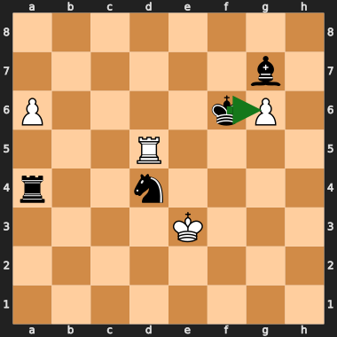
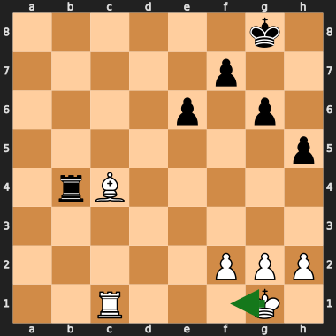
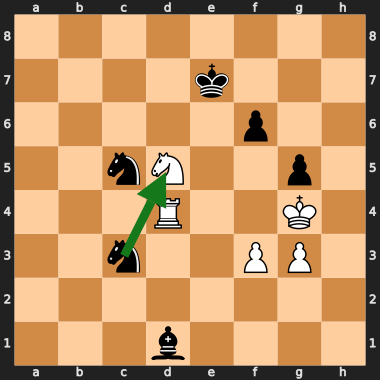

# Eval Overrate & Blind-spot Findings (living document)

**Purpose.** A shared, growing log of positions where Coda's evaluation is
*wrong* — almost always **overrating** its own position — discovered by mining
real gauntlet games against the top-20 engines and cross-checking with
Stockfish (SF) as a trusted third party. This doc is for both humans (Adam) and
other Claude instances. The wandering-bishop work showed the recipe: a doc with
**concrete positions + diagrams + a named theme** is what makes a blind-spot
class *fixable* (there, mixing a few % of self-play-vs-SF into the training set,
unfiltered, measurably cut the overscoring of that class).

**Why a blind-spot can persist behind a top-tier eval.** Measured on T80
(LC0-vs-LC0) test data, Coda's eval is **2nd only to SF** in raw strength — so
the overrate here is *not* "our eval is weak." The working hypothesis is one of
**data coverage**: the positions Coda overrates (held fortresses, drawn R+P /
Q-vs-R endings, 50-move shuffles, simplified minor-piece endings) are
**under-represented in the T80 corpus**, the same way the wandering-bishop
position was. The net scores *what it has seen* superbly; these positions it has
barely seen. Two facts make this the central framing:

- We train on **~200B positions**, so moving the needle on a rare class needs a
  **large, targeted** set of those positions — a handful of EPDs won't register.
- We are about to have **~6M Coda-vs-SF games (~300M positions)** with the SF
  in-game scores usable directly as training labels. These are exactly the
  positions *Coda reaches in play* that LC0-vs-LC0 self-play may never visit.
  This set is the intended vehicle for the fix: it both surfaces the blind-spot
  class at scale and supplies a trusted (SF) label for it.

So this doc has two jobs: (1) characterise the overrate class precisely enough
to confirm it's real and to know what to over-sample, and (2) feed concrete,
SF-scored positions into that correction set.

**Status:** started 2026-06-28. Pipeline is `scripts/game_analysis.py`
(`taxonomy | mine | oracle | reeval | features`). Tooling notes at the bottom.

> **One-line takeaway.** Across the **whole** mined set the overrate is **real
> and systematic** — median clean 2s-search **+136cp** over SF on 135
> drawn/lost candidates, **58** of them confirmed (≥150cp over SF, |SF|≤600,
> **all draws**). The dominant cluster is **simplified minor-piece / fortress
> endgames** (60% endgame, 53% "up material"): the NNUE static is wildly
> optimistic (e.g. **+14.5 vs SF +3.3** on a held fortress) and search only
> *partially* corrects it. **~71% of confirmed overrates are static-rooted
> (NNUE)**, ~21% search-rooted. **Threat features RESTRAIN** the eval toward SF
> (threats-off is *higher*), so they are not the cause — the residual is in the
> base net's lack of fortress / drawn-endgame sense.

---

## How the data is produced (methodology)

1. **Gauntlet.** The **gauntlet net** (`multi-v8-l132-s3-v3-swa`, v8 recipe —
   Coda's strongest net, the one that *played* these games) vs the top-20
   engines, eval-per-move recorded for both sides. Also run at 1.2× and 2× Coda
   time to measure *time-elasticity* (below).
2. **Mine** (`game_analysis.py mine`). Convert both engines' evals to
   **Coda-POV**, `overrate = coda_self − opp_of_coda`, and keep only
   **draws/losses** with a **sustained** overrate (≥150cp over ≥6 plies). A big
   eval that *won* is correct, not an overrate; the load-bearing filter is
   **result + opponent-disagreement together**. This is a coarse PGN-eval
   candidate finder — it selects *which positions to look at*, nothing more.
3. **Re-eval cleanly** (`game_analysis.py reeval`) — **the trustworthy path,
   and the one all numbers in this doc come from.** For each candidate FEN it
   produces, on the **gauntlet net**, three fresh Coda numbers plus SF ground
   truth, all in Coda-POV:
   - **STATIC** — NNUE eval, no search (`coda eval`).
   - **STATIC, threats-off** — FT-only forward, threat-accumulator zeroed
     (`CODA_NO_THREAT_ACC=1`; a degraded path — trust direction, not magnitude).
   - **SEARCH** — fixed-time search (`coda epd -t 2000`; this is the only path
     that prints per-iteration `info` score lines — UCI `go movetime`/`go depth`
     emit none).
   - **SF** — depth-22 ground truth.
   `true_overrate = coda_search − sf`, computed from the **clean** search value
   (never the in-game PGN comment, which carries POV/parse gotchas — see
   §Tooling). **Confirmed** = search ≥150 over SF **and** |SF| ≤ 600 (the cap
   keeps us on positions SF agrees are roughly balanced, excluding genuinely
   lost positions where a big negative SF is correct).

**Net discipline.** Every static/search number here is on the **gauntlet net**
(v8), *not* the embedded-prod / `net.txt` net (035195DB, v6) that a bare `coda
eval` / `coda bench` uses. v6 and v8 share most of the recipe (both have the
wandering-bishop correction) and agree closely on these positions, so there is
**no "self-healed between versions" story** — but the discipline matters: always
pass `--net nets/multi-v8-l132-s3-v3-swa.nnue` to reproduce.

---

## The clean systematic finding — the overrate is real

Robust **medians** over all 135 candidates (means are swamped by lost-position
outliers where SF is hugely negative — use the median):

| number (Coda-POV − SF) | median | what it is |
|---|---:|---|
| `pgn_or` (in-game belief) | **+208** | what Coda thought *during* the game |
| `static_or` (clean static) | **+182** | NNUE eval, no search |
| `staticnoth_or` (threats-off) | **+276** | FT-only, threats zeroed |
| `search_or` (clean 2s search) | **+136** | what Coda believes given clean time |

**58 of 135** candidates are search-confirmed overrates (≥150cp over SF), and
**every one is a draw** (0 losses, 0 wins in the confirmed set — losses fall
outside the |SF|≤600 cap). Search corrects the static *partially* (`search_or <
static_or` in 79/135) but a large residual survives into play.

**Where the overrate lives (the 58 confirmed):**
- **41/58 (71%) static-rooted** — the clean static is *also* ≥150 over SF. The
  NNUE itself is optimistic. **This is the training-correction target.**
- **12/58 (21%) search-rooted** — static honest (<50 over SF) but the 2s search
  runs ≥150 over SF. Search invents optimism the root eval doesn't have.

**Threats RESTRAIN (re-confirmed at scale).** Threats-off static is *higher*
than threats-on in **89/135** (median +68cp higher). The threat block pulls the
eval *toward* SF; it is not the cause of the overrate. This matters because the
initial hypothesis was the reverse ("heavy threat features over-value attacks")
— that's true for a narrow *attack* subclass, but the threat block's net effect
across the mined set is a brake, not an accelerator (mechanism detail below).

---

## The dominant cluster — simplified minor-piece / fortress endgames

A feature scan of the 58 confirmed: **60% endgame**, **53% "up material"**, 64%
"king exposed" (an endgame artifact — bare kings on an open board). The biggest
static-rooted overrates are drawn or barely-better endings the NNUE reads as
crushing:

| position (Coda-POV) | static | search | SF | note |
|---|---:|---:|---:|---|
| `8/6b1/P4kP1/3R4/r2n4/4K3/8/8 b` | **+14.48** | +9.33 | **+3.26** | Black up R+N+B vs R+2P; White's connected a6/g6 passers **hold** (drawn) |
| `8/8/2B5/8/5k2/2K5/8/7N w` | +11.80 | +7.19 | +1.52 | **KBN-v-K** — really won but slow; magnitude overrate (see KBN study) |
| `8/n1b5/8/3K4/8/3k4/8/8 b` | +8.96 | +7.41 | +0.17 | **50-move count already at 73 half-moves** — dead draw; static has no 50mr sense |
| `6k1/5p2/4p1p1/7p/1rB5/8/5PPP/2R3K1 w` | +9.49 | +5.86 | +2.15 | White up a piece for a pawn; ≈+2 not +9 |
| `8/4kp2.../3P3p/...` (PlentyChess R+P) | +4.95 | +1.66 | 0.00 | drawn R+P ending read as +5 static |

The static eval has **no fortress / 50-move / insufficient-progress sense**: it
counts material + piece activity and reads "up a minor with an active rook" as
+9 to +14 even when the position is a known fortress, a 50-move draw, or only
+2. Search shaves a few cp off but cannot see a 50+ ply fortress, so the large
residual survives into play — and these games **drew**. This is exactly the kind
of position the **Coda-vs-SF corpus** should over-sample: it's reached in real
play, it's rare in LC0 self-play, and SF supplies a trusted label (≈+3, ≈0,
≈+2) the net currently can't produce.

---

## The search-rooted tail (21%)

A smaller, distinct class: the **root static is honest** (≈SF) but the **2s
search runs high** in sharp minor-piece middlegames. The search resolves a
tactical sequence over-optimistically and the leaf the PV reaches is overrated,
not the root.

`8/4k3/5p2/2nN2p1/3R2K1/2n2PP1/8/3b4 b` — static **+2.43** (≈SF +2.39), but the
2s search returns **+6.45**.

Whether this is "still an eval problem one ply forward" (the leaf static
overrates) or a genuine search-propagation bug is the open question for this
class — resolvable by walking the PV to the leaf and static-evaling it vs
SF(leaf). If leaf-static ≫ SF(leaf), it's the same training fix one ply forward;
if leaf-static ≈ SF(leaf), it's a real search-optimism bug. (Blocker: Coda
suppresses `info`/`pv` over UCI — need a PV-dump path; see Open questions.)

---

## Time-elasticity: which deficits are tactical vs strategic

From the 1× / 1.2× / 2× gauntlets (Coda_score = 100 − opp_score%, since each
opponent plays only Coda). How much does *more time* close the gap?

- **Tactical / depth-bound (time helps a lot — closeable by NPS, pruning,
  ordering):** Viridithas (52→72, +20), Reckless (31→50, +19), PlentyChess
  (44→62, +18), Clover (+16), Obsidian / Cinder (+14).
- **Strategic / eval-bound (time barely helps — this is where eval *quality* is
  the wall):** Alexandria (50→54, +4), Integral (53→58, +5), Stockfish (34→43,
  +9, partly ceiling).

**Convergent signal:** Integral shows up as *both* a top overrate-draw source
**and** low time-elasticity → it is the cleanest strategic-eval target. Most of
Coda's deficit-to-field, though, is tactical/depth (search-efficiency leverage),
not eval — which is consistent with the eval being top-tier on T80 and the
overrate being a narrow, coverage-driven class rather than broad eval weakness.

---

## Mechanism: threat features restrain, not cause

The threat-accumulator ablation (`CODA_NO_THREAT_ACC=1`) zeros the threat
contribution, falling to an FT-only forward. This is a **degraded** path
(threats were trained jointly), so trust the **sign/direction**, not magnitudes.
On the original hand-picked attack/queen positions (statics white-side, SF
Coda-POV):

| position | static | threats-OFF | Δ | SF |
|---|---:|---:|---:|---:|
| Stormphrax m40 | +0.60 | +4.76 | **+4.16** | 0.00 |
| Quanticade m27 | −0.08 | +5.46 | **+5.54** | +0.38 |
| PlentyChess m34 | −0.74 | +3.03 | **+3.77** | +0.07 |
| Viridithas m72 | +3.19 | +2.38 | −0.81 | +0.18 |
| Clover m81 (Coda-POV +7.52) | −7.52 | −6.30 | +1.22 | +1.82 |
| Integral m57 | −1.37 | −1.05 | ~0 | 0.00 |

On every attack/queen position the threat block pulls the eval **down toward
SF** — FT-only over-attacks (Stormphrax +4.76, Quanticade +5.46, PlentyChess
+3.03), and turning threats *on* brings them to ≈0. This is re-confirmed at
scale: threats-off static is higher in 89/135 candidates (median +68cp). So the
intuition "the threat features inflate attacks" is backwards as a *net* effect —
the residual overrate is a **base-net** problem (e.g. Viridithas is +2.38 even
threats-off, vs SF +0.18), and it lives in **simplified endgames**, not the
attack class threats already restrain.

---

## The KBN conversion study — eval was right, not a pruning bug

The headline game that kicked this investigation off (Coda scoring ~+8 vs
Integral ~0, drawn) turned out **not** to be an eval blind-spot. It reduced to
**KBN-vs-K**, a forced win. Coda's eval was *correct* (static **+10.83**, SF
mate); the failure was **conversion/technique** — Coda burned the 50-move count
shuffling, then played **Bd5?? Kxd5** hanging the bishop into KN-vs-K, a dead
draw. Training data will not fix this class; it is endgame technique
(mate-distance / TB knowledge / 50-move awareness in search). It's logged
because it's the canonical "big eval that drew" and shows why the **result + SF**
filter matters: without SF this looks like a −8 eval bug; with SF it's a
conversion bug. **In deployment KBN-v-K is fully covered by Syzygy TB** (4 men);
this gauntlet ran TB-less, which is why it surfaced.

Adam's hypothesis was that the conversion failures might be a **bad-pruning**
bug ("we should find most of these mates given our depth"). Tested at fixed time
(never fixed depth — it explodes in complex positions), on the 7
conversion-failure positions:

**Why Coda shuffles (mate horizon).** Walking SF's mating line and probing Coda
(5s) at decreasing true mate-distance, Coda's **KBN mate horizon is ~mate-9/10**:
within it Coda *does* find the mate (no structural blindness / no missing mate
logic), but the game position is **mate-33**, over 3× the horizon. Worse, the cp
eval has **no useful gradient — it falls as the mate nears** (cp471@mate20 →
cp351@mate11): the NNUE reads a flat ~+6 (B+N material) regardless of king
placement, so the search has *nothing to climb* to navigate the ~60-ply
king-driving maneuver into its own horizon. Even SF needs 25s + SMP and still
reports `cp 8115`, not a mate — this KBN is genuinely deep, not a Coda quirk.

**Per-feature ablation (the correct test).** Disabling features one at a time at
fixed 8s (preserves general depth) on boundary positions where baseline is
*just* failing:

| position | baseline | NO_LMR | NO_RFP | NO_FUT | NO_RFP+FUT |
|---|---|---|---|---|---|
| GAME mate33 | d26/cp626 | d26/cp626 | d20/cp631 | d22/cp639 | d17/cp654 |
| ply24 mate12 | d18/cp422 | d18/cp422 | d17/cp402 | d21/cp438 | d17/cp410 |
| ply26 mate11 | d19/cp351 | **d19/cp351** | **d19/mate12** | **d21/cp20473** | d19/cp346 |
| ply30 mate11 | d19/cp354 | d19/cp354 | **d19/cp17432** | d21/cp9217 | d17/cp358 |

- **RFP-off and FUT-off alone flip cp→mate at the boundary, at the *same
  depth*** (ply26: `d19/cp351` → NO_RFP `d19/mate12`). Same d19 ⇒ pruning hid
  the line, *not* lost depth. Reproducible across runs.
- **NO_LMR is byte-identical to baseline** (not a wiring bug — `FEAT_LMR` is read
  at search.rs:4310/4434). LMR only *reduces then re-searches*, so the mating
  line still surfaces; the binding prunes in flat-eval endgames are the **hard**
  static-margin ones (RFP / futility), which cut with no re-search.
- **But it's immaterial to the actual game:** with RFP+FUT both off the mate-33
  game position stays flat at **cp654 — still no mate** (and only d17, because
  removing both prunes *costs* depth). The misfire is worth ~**1 ply of
  mate-horizon**; `NO_RFP+FUT` is *worse* than either alone at ply26.

So the KBN draw is **not** a pruning bug: root cause = flat/inverted NNUE
gradient + mate-distance ~3× horizon, TB-covered in deployment.

**The investigation did independently re-confirm a real, separate finding:** RFP
(and to a lesser extent futility) **does prune good lines** when the static eval
is a flat plateau above beta — the same failure quantified in
`docs/rfp_futility_audit_2026-06-24.md`. RFP is the dominant pruner (**301/Kn**),
and the `RFP_AUDIT` null-verification shows a **42–45% false-positive rate at
d=1–3 (98% of RFP volume)**: Coda's shallow base margin multiplier (~34) is
**half the peer consensus (~70–87)**, so it cuts at beta+222 @ d6 where peers
require beta+420–522. The mate/TB guard on the eval side
(`static_eval.abs() < MATE_SCORE-200`, search.rs:3586) doesn't help the KBN case
(eval is +6 cp, nowhere near a mate score) — the missing gate would be
**phase/material awareness**, not a mate guard.

**Discipline / what NOT to conclude.** A 42% verification-FP rate does **not**
prove RFP costs Elo — RFP is a *speculative* prune whose net effect (depth
bought ≫ lines lost) is positive, and the live **SPSA tuner pushes the base
margin *down* (37→34), toward *more* aggression** — direct evidence shallow RFP
currently pays in self-play despite the high FP rate. Every *conditional* RFP
gate we've tried (threat-aware, opponent-threat, correction-aware,
complexity-aware) has **H0'd**. The one promising-but-untested lever is the
**blanket RFP-1 margin raise on the v10 net** (old "100/70 optimal" notes are
V5-era / stale — different eval scale), with an SPSA retune and `RFP_AUDIT`
FP-rate as the mechanism check — but the SPSA-down signal argues against it, so
temper expectations.

---

## What we ruled out

- **"The headline overrates vanish under clean re-search."** An early
  4-position hand-pick (Stormphrax m40, Quanticade m27, PlentyChess m34,
  Viridithas m72) seemed to show the overrate evaporating. Those four were all
  the **attack** class — exactly where threats + search *do* correct — so the
  hand-pick under-sampled the actual bulk (endgame fortresses). The clean
  135-candidate re-eval shows the systematic overrate **is real**. Lesson:
  don't generalise from a class-skewed hand-pick; mine the whole set.
- **"Threat features cause the overrate."** Ruled out — threats restrain (89/135
  higher with threats off). The residual is base-net.
- **"The conversion failures are a bad-pruning bug."** Ruled out for the KBN
  class (gradient + horizon + TB-covered). RFP/futility *do* misfire on
  flat-eval plateaus, but that's a separate, already-known finding and is
  immaterial to the KBN games.
- **"Static NNUE is the culprit only for the attack theme."** Wrong — static is
  the dominant culprit for the **endgame-fortress** cluster (41/58
  static-rooted), not the attack theme.

---

## Actionable hypotheses & next steps

1. **Training correction set (endgame-fortress cluster first). ⭐ UNBLOCKED.**
   The clean re-eval gives a trustworthy confirmed set
   (`/tmp/confirmed_clean.tsv`, 58 SF-rescored draws). Emit these as
   **SF-rescored EPD/binpack** and mix into training. **Prioritise the dominant
   static-rooted cluster:** simplified minor-piece / fortress endgames, drawn
   R+P and Q-vs-R endings, 50-move / insufficient-progress draws — *not* the
   attack class (threats+search already fix it). 58 is thin against a 200B
   corpus, so this is a *characterisation* sample, not the training signal
   itself: the real volume comes from the **~6M Coda-vs-SF games (~300M
   positions)**, which contain this class at scale with SF labels. Use the 58 to
   define what to over-sample / re-weight in that corpus. Add an EPD emitter to
   `game_analysis.py` (the confirmed rows already carry FEN + SF score).
2. **Validate the coverage hypothesis directly.** Quantify how rare the
   fortress / drawn-endgame / 50-move class is in T80 vs in the Coda-vs-SF
   corpus (e.g. sample both, bucket by the same feature scan used here). If the
   class is markedly under-represented in T80 and well-represented in Coda-vs-SF,
   that confirms the mechanism and tells us the correction is *coverage*, not
   architecture.
3. **Leaf-eval walk (search-rooted tail, 21%).** For each search-rooted
   position, take Coda's PV to the leaf and static-eval it vs SF(leaf).
   leaf-static ≫ SF(leaf) → still eval/training one ply forward (same fix);
   leaf-static ≈ SF(leaf) → genuine search-propagation bug. *Blocker:* Coda
   suppresses `info`/`pv` over UCI — need a PV-dump path or instrument search.
4. **Widen the confirmed set past 58.** Run the full multi-gauntlet focused on
   strategic opponents (Alexandria, Integral, Stockfish), re-mine, `reeval`.
   Grows the characterisation sample and sharpens the feature buckets for #2.
5. **Drawn-endgame eval damping (separate track).** Consider whether 50-move /
   shuffle awareness or endgame eval scaling reduces the cluster's overrate as a
   search-side complement to the training fix; test on OB.
6. **RFP-1 margin raise on v10 (separate track, from the KBN study).** Shallow
   RFP cuts good lines (42–45% `RFP_AUDIT` FP @ d1–3; base margin ~34 vs peers
   ~70–87). Untested on the v10 net. Worth one clean SPRT of raising
   `RFP_MARGIN_NOIMP` toward peers + SPSA retune, `RFP_AUDIT` FP-rate as the
   mechanism check — but SPSA pushes the margin *down* and all conditional RFP
   gates have H0'd, so temper expectations.

## Open questions

- Is the static overrate present in *quiet won/equal* positions too, or only in
  the drawn-endgame tail the mine selects for? (The mine conditions on
  draws/losses, so it can't see won-position overrates by construction.)
- Search-rooted tail: eval problem one ply forward, or a real search bug? (Leaf
  walk, item 3.)
- How much of the strategic gap to Alexandria/Integral is these blind-spots vs
  general eval noise?
- Conversion: is there a gate that keeps aggressive shallow RFP where it pays
  (tactical middlegame) but suppresses it on flat-eval / low-material plateaus,
  given blanket de-aggression and all prior conditional gates have failed?

---

## Tooling

- `scripts/game_analysis.py` — `taxonomy | mine | oracle | reeval | features`.
  Works in Coda-POV. PGN eval comments are STM-POV; python-chess strips the `{}`
  braces (regex must NOT require `{`). Mate → ±30000. `mine` filters draws/losses
  with sustained overrate (a coarse PGN-eval candidate finder). `oracle` is the
  legacy SF-ground-truth path **from the PGN value** (POV/parse gotchas — don't
  trust its numbers). **`reeval` is the trustworthy path:** fresh **gauntlet-net**
  Coda numbers — `static` (`coda eval`), threats-off static
  (`CODA_NO_THREAT_ACC=1`), `search` (`coda epd -t <ms>` — UCI `go` emits **no**
  info lines, only `epd` does) — vs SF, overrates from the clean search. Always
  pass `--net <gauntlet-net>`; it loads the net 3× per position (slow, ~20s/pos),
  so run it backgrounded.
- `scripts/gen_overrate_svgs.py` — regenerates board diagrams as
  `docs/img/overrate_*.svg` (python-chess `chess.svg`; green arrow = SF's deep
  best move). SVGs render natively on GitHub **and** GitLab. Add a position to
  its `POSITIONS` list and re-run; reference with ``.
- Gotchas: `len(board.pieces(...))` not `chess.popcount(...)` on a SquareSet;
  Coda `eval` prints `NNUE evaluation +X.XX (white side)` — negate for Black to
  get Coda-POV.
- Data: clean scored set `/tmp/scored_clean.tsv` (135 rows), confirmed subset
  `/tmp/confirmed_clean.tsv` (58). Slice: `/tmp/gauntlet_v8_0628.pgn`. Repro:
  `mine /tmp/gauntlet_v8_0628.pgn --out cand.tsv` then `reeval cand.tsv --net
  nets/multi-v8-l132-s3-v3-swa.nnue --movetime 2000 --depth 22`.
- SF binary: `/home/adam/chess/engines/Stockfish/src/stockfish`.

## Changelog

- **2026-06-28** — Doc created. First wave: 43 mined candidates → 35 SF-confirmed
  overrates, static-vs-search decomposition, three themes named with diagrams,
  KBN Integral game classified as conversion (not eval). Diagrams converted from
  ASCII to SVG (`scripts/gen_overrate_svgs.py`, green arrow = SF best move) for
  GitHub + GitLab rendering.
- **2026-06-28** — Conversion / "bad pruning" investigation. All-off ablation
  (confounded), KBN mate-horizon curve (~mate-9/10; flat/inverted gradient), and
  the correct per-feature ablation. Result: KBN draw is **not** a pruning bug
  (gradient + horizon + TB-covered in deployment), but RFP/futility *do* prune
  good lines on flat-eval plateaus (re-confirms `RFP_AUDIT` 42–45% shallow FP).
- **2026-06-28** — Threat ablation on the gauntlet net: **threats restrain, not
  cause** (FT-only over-attacks; threats pull toward SF). Surviving overrates are
  base-net.
- **2026-06-28** — **Clean full re-eval (became authoritative).** Re-ran the
  whole mine end-to-end on the gauntlet net via a new `reeval` subcommand (`Coda`
  engine class + clean static / threats-off static / `coda epd` fixed-time
  search, all vs SF d22; PGN-value path dropped). 135 candidates → **58
  search-confirmed overrates, all draws**; median clean search **+136cp** over
  SF; dominated by simplified minor-piece / fortress endgames (60% endgame, 53%
  up-material; 71% static-rooted, 21% search-rooted). Corrected the earlier
  4-position "headline overrates vanish" hand-pick (a class-skewed artifact —
  those four were all the attack class threats+search already fix). New diagrams:
  `overrate_clover_fortress_m77`, `overrate_stormphrax_m39`,
  `overrate_tarnished_searchrooted_m43`.
- **2026-06-28** — **Full doc tidy-up.** Integrated the clean re-eval throughout
  rather than as end-of-doc correction banners; the superseded cherry-pick and
  the layered ⚠️/SUPERSEDED sections were collapsed into "What we ruled out."
  Added the training-corpus framing (200B corpus; ~6M Coda-vs-SF ≈ 300M positions
  as the correction vehicle; T80 eval 2nd-to-SF + the coverage / under-
  representation hypothesis) to Purpose and action items #1–#2.
