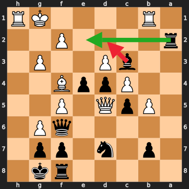
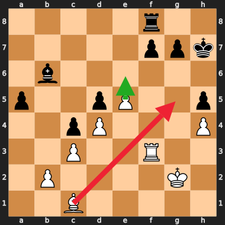
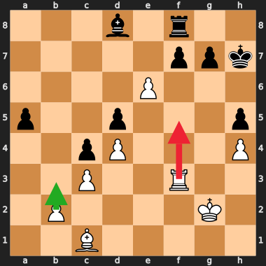
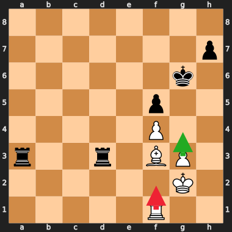

# Bishop/rook "sortie" eval over-valuation & the threat color-asymmetry

**2026-06-17.** Two linked findings from the overrate-corpus thread
(`docs/overrate_corpus_thread_2026-06-15.md`):

1. **The finding (with diagrams):** current trunk's NNUE systematically
   over-values active **bishop and rook "sorties"** — sallying a piece to an
   aggressive square — over the correct quiet/positional move. It persists at
   depth, so it is an *eval* property, not a search-depth one.
2. **The cause investigation:** Coda's threat features are measurably
   color-asymmetric, and that asymmetry sits on exactly the bishop/rook
   (same-type-pair) threats. **It is NOT a train/inference bug** — training and
   inference agree exactly (proven below). It is a *deliberate, documented
   tradeoff* in the threat feature design. Whether it materially causes the
   over-valuation is open; it is a contributor (17–70cp) but smaller than the
   over-valuation itself (100–300cp).

---

## 1. The finding — over-valued piece sorties

"Sortie" = the engine sends a bishop or rook to a forward/active square that
*looks* aggressive but is refuted, instead of the correct quiet move. Red
arrow = the move Coda wrongly prefers; green = the move SF (deep) plays.

### Bishop sortie — the seed case (lichess RpZ9LbYM m35)
Black is slightly worse (≈ −1.9). Coda wants **Bd2** (bishop sallies out to
attack the f4-bishop); it loses to ≈ −4.7 after Qxe4. Correct is the calm
**Rxe2**.



### Bishop sortie vs the right plan (gauntlet m32)
Roughly level. Coda wants **Bg5** (active bishop) instead of **e6** — pushing
the passed pawn, the actual point of the position.



### Rook sortie vs consolidation (gauntlet m33, same game)
Coda wants **Rf5** (rook lunges forward) instead of the quiet **b3**.



### Rook sortie — endgame (stvSVmsf m54)
R+P endgame. Coda wants **Rf2** instead of the correct **g4**.



**Pattern.** Across the corpus the recurring `am` (avoid) moves are bishop
sorties (Bd2, Bg5, Bf3, Bd6, Bxf4, Bd4+) and forward rook moves (Rf5, Rf2,
Rf8), where the `bm` (best) is a quiet pawn push or consolidation. The net
appears to over-weight raw **piece activity** relative to what the position
supports. (Caveat: most corpus positions come from lost games, so some are
"best defence in a bad position" rather than equal-position blunders; the
signal is suggestive, not yet proven decisive — `testdata/overrate.epd` is the
test set to confirm a fix against.)

---

## 2. Why — the threat color-asymmetry

### 2a. The eval is color-asymmetric on these positions
A correct, symmetric NNUE must evaluate a position and its color-mirror to
exactly opposite values (white-side `eval(mirror) = −eval(orig)`, i.e. the sum
is 0). Measured (pawns):

| position | v5 net (no threats) | v10 prod (threats) |
|---|---|---|
| startpos (control) | 0.00 | 0.00 |
| seed Bd2 (bishop) | 0.00 | **0.27** |
| Bg5 (bishop) | 0.00 | **0.17** |
| Rf5 (rook) | 0.00 | **0.70** |

The **v5 net (no threat features) is perfectly symmetric** on every position;
the **v10 threat net is asymmetric** (up to 70cp) on the bishop/rook positions.
The *only* difference is the threats — so the asymmetry comes entirely from the
threat features, and lands on the same piece types as the over-valuation.

### 2b. Localized to the same-type-pair semi-exclusion
The threat enumeration dedupes "A attacks B" vs "B attacks A" for same-type
pairs by keeping one direction. The tie-break (`PiecePair::base`,
`src/threats.rs`) is on **physical squares**:
```rust
let below = ((attacking_sq as u8) < (attacked_sq as u8)) as u32;
```
`attacking_sq < attacked_sq` is **not** invariant under a vertical flip (the
flip reverses square order), so a same-type pair keeps the *opposite* member in
a position vs its mirror → different threat features → asymmetric eval.
Bishops/rooks are the long-range pieces most often in such mutual-attack /
x-ray pairs, so they take the brunt.

### 2c. It is NOT a train/inference mismatch (the important negative result)
The tempting hypothesis — that *training* computed threats one way and
*inference* another — is **false**, verified two independent ways:

- **Read the trainer.** `bullet/crates/bullet_lib/src/game/inputs/chess_threats.rs`
  has a **"C8 fix (coda 2026-04-22 audit)"** that *deliberately* converts
  Bullet's bf-frame squares back to physical (`phys_flip`) for the
  semi-exclusion, *specifically to match Coda inference*.
- **Run the parity fuzzer.** `./coda fuzz-threats --count 20000 --postfix`
  diffs inference `enumerate_threats` against the post-fix Bullet port:
  **0 mismatches / 40000 evals (W=0, B=0)**. Inference and training produce
  identical threat features on every position.

So there is **no live divergence**. The stale `enumerate_threats_bullet_ref`
comment (which described the *pre*-fix bf-frame state as "Bullet's intended
output") was misleading and has been corrected; `_postfix_ref` + the fuzzer are
the live, 0-mismatch reference.

### 2d. It is a deliberate tradeoff, not a bug
Physical-square semi-exclusion was chosen because it is **STM-invariant**:
the kept-direction doesn't change when the side to move flips, which is
*required* for Coda's incremental threat-delta accumulator to stay correct
(a per-move update can't afford to rebuild all same-type-pair features every
ply). The mirror-symmetric alternative (bf-frame, STM-relative) is
**STM-dependent** and would break incremental updates. So the design trades a
small, consistent color-asymmetry for clean incremental deltas. The net is
trained on this exact (asymmetric) representation and partly compensates,
leaving the measured 17–70cp residual.

---

## 3. So what — options

The "critical train/inference bug" is **ruled out**. What remains is a
genuine but bounded feature-design question:

1. **Most likely: leave it, pursue eval via data.** The asymmetry (17–70cp) is
   smaller than the over-valuation (100–300cp), so it is at most a partial
   cause. The bishop/rook over-valuation is better attacked as a normal eval
   sparse-coverage problem — targeted, LC0/SF-scored "forced sortie" data added
   to training (`docs/eval_blindspot_training_fix_2026-06-17.md`), verified
   against `testdata/overrate.epd`.
2. **Symmetric threats (research, needs retrain).** A semi-exclusion tie-break
   that is *both* STM-invariant *and* mirror-symmetric would remove the
   asymmetry. No clean square-comparison achieves both for all same-type pairs
   (file-based is flip-invariant but fails same-file pairs; the king-file
   mirror complicates it further), so this is a real design problem + a GPU
   retrain with uncertain payoff. A cheaper probe: a net trained with threats
   *disabled for same-type pairs* would bound how much Elo the asymmetry costs.
3. **Quantify first.** Before either, measure how much of the corpus
   over-valuation the asymmetry actually accounts for: re-score
   `testdata/overrate.epd` and check whether the over-valued sorties correlate
   with high same-type-pair threat density / large mirror-residual. If the
   correlation is weak, (1) is clearly the path.

**Bottom line:** the threat features are color-asymmetric by a deliberate
STM-invariance tradeoff, training and inference agree exactly (0/40000), so
there is no bug to fix here — only an optional, retrain-gated symmetry
improvement whose payoff should be measured before committing GPU time.
